# InspireRV & InspireRV-Computer

## InspireRV

Front View|Back View
:--------:|--------:
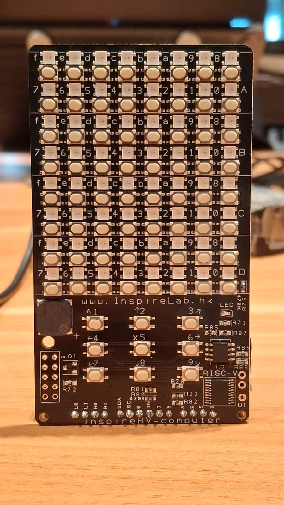|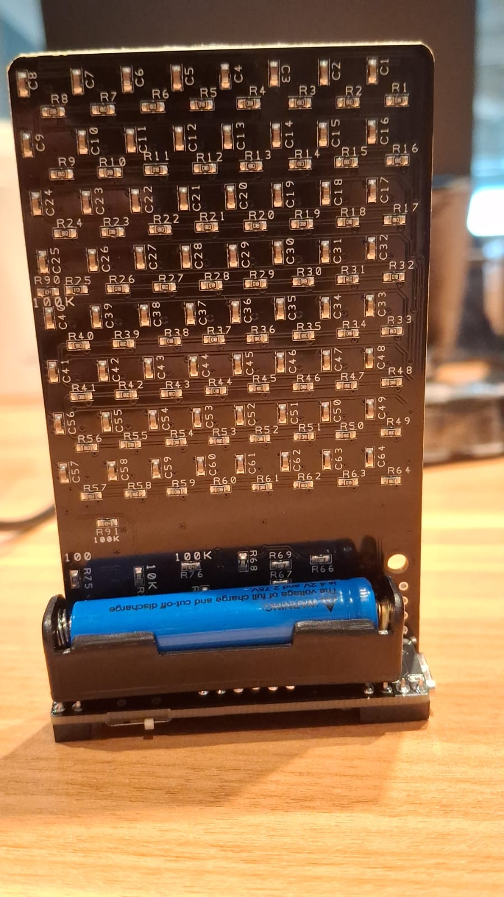

InspireRV is a 8x8 LED matrix board that uses CH32V003 microcontroller, primarily used by students to learn more about binary numbers, simple programming or just to draw anything.This repository contains the `emulator` and `hardware program` for InspireRV project. 

### Extra Note
> Refer to this branch to check the `most updated InspireRV program`.

> Emulator currently only works on WindowOS.

> This branch doesn't contain the robot_car function, u have to go to `  KEERTHANA'S_SUMMER2026_WORK` branch


## InspireRV-Computer

Front View|Back View
:--------:|--------:
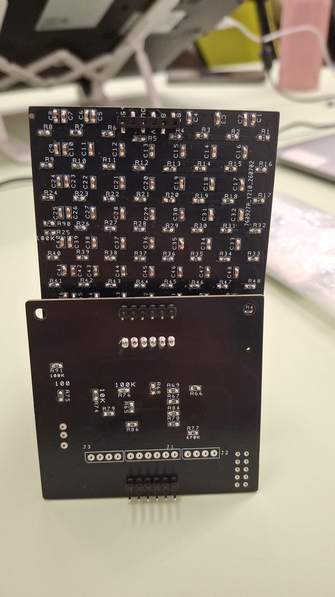|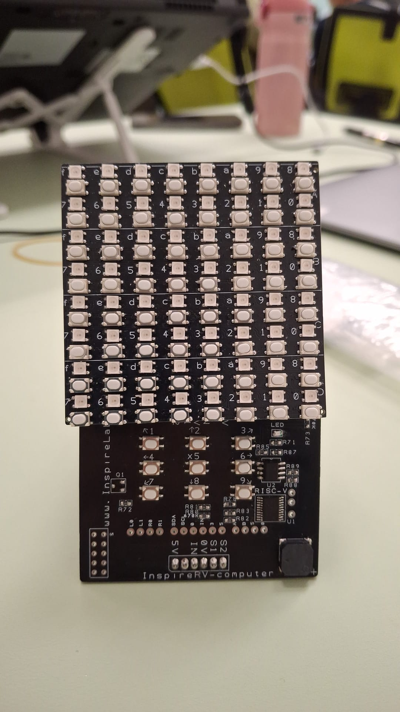

InspireRV-Computer is a 8x8 LED matrix board that uses CH32V003 microcontroller, primarily used by students to learn more about binary numbers, simple programming or just to draw anything.This repository contains the `emulator` and `hardware program`, similar like InspireRV project. 

> The only main difference is that this InspireRV-Computer's 8x8 Matrix Board can be detached and connected using **male to female jumper wires**. Hence, enabling the 8x8 Matrix Board buttons to be pressed from a further distance.

## Project Structure

* `.github`:
  * `workflows`: GitHub Actions workflows.
  * `Doxyfile`: Doxygen configuration.

* `.vscode`:
  * `settings.json`: Ensure VSCode settings is like this roughly:
    * Set the default compiler to `riscv-none-elf-gcc` for IDE integration.
    * Make sure to also add the terminal `MSYS2 MinGW64"` because this program cannot be run in other terminal such as CMD, Powershell, Git Bash, etc.

    ```
      {
        "C_Cpp.default.compilerPath": "riscv-none-elf-gcc",
        "files.associations": {
            "Doxyfile": "doxyfile",
            "stdlib.h": "c",
            "driver.h": "c",
            "image.h": "c",
            "ch32v003fun.h": "c",
            "color_utilities.h": "c",
            "ws2812b_dma_spi_led_driver.h": "c",
            "ws2812b_simple.h": "c",
            "funconfig.h": "c",
            "stdint.h": "c",
            "unistd.h": "c",
            "compare": "c",
            "colors.h": "c",
            "string.h": "c",
            "stdio.h": "c",
            "ch32v003_gpio_branchless.h": "c",
            "music.h": "c",
            "rv.h": "c",
            "complex": "c",
            "buttons.h": "c",
            "codebook.h": "c",
            "mel_mx.h": "c",
            "twiddles_res13.h": "c",
            "algorithm": "c",
            "inttypes.h": "c",
            "i2c_events.h": "c",
            "riscv-disas.h": "c",
            "ch32v003_i2c.h": "c",
            "i2c_tx.h": "c",
            "oled_min.h": "c",
            "array": "c",
            "string": "c",
            "string_view": "c"
        },
        "terminal.integrated.profiles.windows": {
            "MSYS2 MinGW64": {
                "path": "C:\\msys64\\usr\\bin\\bash.exe",
                "args": [
                    "--login",
                    "-i"
                ],
                "env": {
                    "MSYSTEM": "MINGW64",
                    "CHERE_INVOKING": "1",
                    "MSYS2_PATH_TYPE": "inherit"
                }
            }
        },
    } 
    ```

  * `c_cpp_properties.json`: Ensure VSCode settings is like this roughly:
    * complierPath must be set to **gcc.exe** as this will be the essential tool to compile your program. 
    
    ```
      {
      "configurations": [
          {
              "name": "Win32",
              "includePath": [
                  "${workspaceFolder}/**"
              ],
              "defines": [
                  "_DEBUG",
                  "UNICODE",
                  "_UNICODE"
              ],
              "cStandard": "c17",
              "intelliSenseMode": "windows-gcc-x64",
              "compilerPath": "C:/msys64/ucrt64/bin/gcc.exe"
          }
      ],
      "version": 4
    }
    ```

* `ch32v003_stt`
  * Simple spoken digit recognition.
  * Originally from <https://github.com/brian-smith-github/ch32v003_stt>
  * Read its [README.md](ch32v003_stt/STT-README.md) for more information.

* `ch32v003fun`
  * `driver.h`: Contains the most frequently used functions for the CH32V003.
  * `i2c_events.h`: Contains some frequently used I2C functions written manually.
  * `i2c_tx.c`, `i2c_tx.h`, `oled_min.c`, `oled_min.h`: Contains some frequently used functions for the SSD1306 OLED display. Comes from <https://github.com/eric15342335/inspirelab-game>
  * `ws2812b_simple.h`: Contains one function for controlling the **WS2812B LEDs**.
  You need to declare the following variables in your code:
  In `funconfig.h`:
  
    ```c
    #define FUNCONF_SYSTICK_USE_HCLK 1
    ```

    In your code (e.g. `main.c`):
  
    ```c
    #define WS2812BSIMPLE_IMPLEMENTATION
    // ...
    #include "ws2812b_simple.h"
    ```

  * Use this function below to control the which of the 64 LEDs in array to turn on:
    > static inline void **WS2812BSimpleSend( GPIO_TypeDef * port, int pin, uint8_t * data, int len_in_bytes);** 
    * Example of usage:     `WS2812BSimpleSend(LED_PINS, (uint8_t *)led_array, NUM_LEDS * 3);`


  * Originally from the `extralibs` folder in <https://github.com/cnlohr/ch32v003fun>

* `data`
  * `buttons.h`: Button ADC calibration data.

    Contains the ADC value of each button in InspireRV. Even though this program is used for InspireRV, this is defined in `funconfig.h` because this whole program is derived from `InspireMatrix` code.

    ```c
    #define INTERNAL_INSPIRE_MATRIX 1
    ```

  * `colors.h`: Contains the color palette(to choose **new foreground/background** color), 64 LEDs saved color data (called `led_array`), and multiple function for the `InspireRV`
    * Multiple functions:
      > color_divide(color_t color, uint8_t divider)

      > set_color(uint8_t led, color_t color, uint8_t ledDivisor)

      > set_color_no_div(uint8_t led, color_t color)

      > fill_color(color_t color)

      > fill_logo(void)

      > clear(void)  

  * `fonts.h`: This file is not used in this `InspireRV` program.

  * `music.h`: Frequencies, durations and functions for playing music using a buzzer.
  To play sound, use `JOY_sound()`.

* `emulator`
  * In the end, some part of the code is **not used for the emulator**.
  * Support development of basic embedded system software on Windows/MacOS without requiring physical hardware.
  * Aims to achieve function compatibility with the `ch32v003fun` library.
    * `adriel's_2026_work`: Handles key press event for WindowsOS, MacOs and InspireRV. It also contains essential functions needed in **new_emulator_system**.
      * *system_window_mac* and *system_window* is not used for emulator if you want to run the program in WinOS or MacOS. 
    * `emulator_driver`
      * This folder contains the main function that handles each key press, specifically for `button 1 to 9` stored in **extra_function.c**
  * `ws2812b_simple.c` : aimed to render the 8x8 LED matrix in emulator, similar to how the program render the LED in the real InspireRV.

* `emulator-screen`
  * `(brightness_control.c)` : LED brightness control function that occurs when you press **button 2** in either PAINTING_SPACE or CODING_SPACE page is stored here.
  * `(led_matrix_screen.c)` : When emulator start, this is the function that is used to handle the whole emulator program logic, movement and changes. This is only called once in `switch_page.c`. 

* `misc (UNUSED)`
  * This file is derived from `InspireMatrix` old project. And, the file contained here is not used at all.
  * `libgcc.a` required by the `ch32v003fun` library on MacOS. See [here](misc/README.md) for more information.

* `new_emulator_system`
  * **What is Emulator?**
    * A piece of software (or hardware) that allows one device to act exactly like another.
  * `switch_page.c` is the file to execute the emulator in the terminal.
  * The main emulator `Makefile` logic that starts and executes the emulator program is stored in this folder. This is the only Makefile you have to care when compiling multiple C and header files for emulator. 
    * Compiled C files for emulator are converted into object files and stored into `myObjects` folder.

* `coding_space`
  * This folder contains multiple files that handle 2 main things related to Coding Space of InspireRV:

    * **coding_space**: handles the *whole* logic that runs the `Coding Space` feature of InspireRV emulator
    
    * **code_save_space**: handles the *whole* logic that save and load the 4-canvas of `Coding Space` of InspireRV emulator. There are **8 slots** where u can save into or load from.

* `painting_space`
  * This folder is somewhat similar to `coding_space` folder. It contains multiple files that handle 2 main things related to Painting Space of InspireRV:

    * **painting_space**: only contains some of the functions that runs the `Painting Space` feature when u press any button from `1 to 9`. These functions are implemented in either 2 of these file called `led_matrix_screen.c` and `extra_function.c`
    
    * **code_save_space**: handles the *whole* logic that save and load the painting canva of `Painting Space` of InspireRV emulator. There are **8 slots** where u can save into or load from.

* `xpacks\@xpack-dev-tools\...`
  * This should be the file added automatically after you have installed `[xPack riscv-none-elf-gcc]`. Check what you need to setup below for further clarification.

* `image`
  * This folder contains a bunch of pictures used for `README.md` for documentation purpose.

* `real_hardware`
  * This folder contains all the functions, logics, Makefile that compile and flash the programs into InspireRV.
  * This folder contain the program for InspireRV and InspireRobot, but they are not currently integrated together because the chip memory space is not enough.
  * `main.c` : InspireRV hardware logic/code is stored here.
  * `hardware_binary_game` : binary game and addition game code are stored here. 

## Typical Buttons ADC Value for InspireRV and InspireRV-Computer (To Be Updated)


**InspireRV** column with the reference board's actual pin/signal, and the **InspireRV-Computer** column with what you measure on the custom board.

## LED Chain (WS2812, Index 0–63)

| LED Index | InspireRV | InspireRV-Computer |
| --- | --- | --- |
| LED 0  |129|Not Working|
| LED 1  |140|Not Working|
| LED 2  |150|Not Working|
| LED 3  | | |
| LED 4  | | |
| LED 5  | | |
| LED 6  | | |
| LED 7  | | |
| LED 8  |213|Not Working|
| LED 9  | | |
| LED 10 | | |
| LED 11 | | |
| LED 12 | | |
| LED 13 | | |
| LED 14 | | |
| LED 15 | | |
| LED 16 | | |
| LED 17 | | |
| LED 18 | | |
| LED 19 | | |
| LED 20 | | |
| LED 21 | | |
| LED 22 | | |
| LED 23 | | |
| LED 24 |454|Not Working|
| LED 25 | | |
| LED 26 | | |
| LED 27 | | |
| LED 28 | | |
| LED 29 | | |
| LED 30 | | |
| LED 31 | | |
| LED 32 |129|130|
| LED 33 | | |
| LED 34 | | |
| LED 35 | | |
| LED 36 | | |
| LED 37 | | |
| LED 38 | | |
| LED 39 |202|204|
| LED 40 |213|214|
| LED 41 | | |
| LED 42 | | |
| LED 43 | | |
| LED 44 |259|259|
| LED 45 | | |
| LED 46 | | |
| LED 47 | | |
| LED 48 |310|311|
| LED 49 | | |
| LED 50 | | |
| LED 51 || |
| LED 52 | | |
| LED 53 |391|391|
| LED 54 | | |
| LED 55 | | |
| LED 56 |453|454|
| LED 57 | | |
| LED 58 | | |
| LED 59 | | |
| LED 60 | | |
| LED 61 |600|601|
| LED 62 |640|639|
| LED 63 |683|683|

## Special Buttons (JOY1–JOY9)

| LED Index | InspireRV | InspireRV-Computer |
| --- | --- | --- |
| Button 1 |683|686|
| Button 2 |619|437|
| Button 3 |564|318|
| Button 4 |514|244|
| Button 5 |468|194|
| Button 6 |427|150|
| Button 7 |389|150|
| Button 8 |352|112|
| Button 9 |320|66|

## What to Setup Beforehand

* [xPack riscv-none-elf-gcc](https://xpack-dev-tools.github.io/riscv-none-elf-gcc-xpack/docs/install/)
  * The RISC-V cross-compiler toolchain. Provides `riscv-none-elf-gcc, riscv-none-elf-size`, etc. The tools your Makefile uses to compile C code into firmware that runs on the CH32V003 chip.
  

* [Zadig](https://zadig.akeo.ie/#)
  * A Windows USB driver switcher. Only needed if you use the `wlink-win-x64 build`. It swaps the WCH-LinkE's driver from WCH's owned driver to WinUSB,so the `wlink CLI` can talk to it. **Not needed** if you use `wlink-win-x86`.
    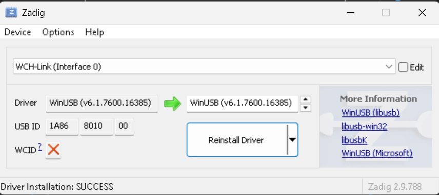
    *  Turn ✔️ the `List All Devices` in Options.
    * Ensure to choose `WCH-Link(Interface 0)` & `WinUSB` as the driver to be switched..
  * This is `optional` because you can  flash program by WCH-LinkUtility. The reason why wlink is used here because I believe it's more easier for developer to flash program via VS Code.

* [wlink](https://github.com/ch32-rs/wlink)
  * An open-source command line tool for flashing firmware to your CH32V003 board via the WCH-LinkE. This is what your `make flash` target calls to automatically `write app.bin` to the chip, no GUI required.
  * This is `optional` because you can  flash program by WCH-LinkUtility. The reason why wlink is used here because I believe it's more easier for developer to flash program via VS Code.

* [WCH-LinkUtility](https://www.wch.cn/downloads/WCH-LinkUtility_ZIP.html)
  *  The official GUI flashing tool from WCH. Useful for one-off manual flashing, reading chip info, or updating the WCH-LinkE firmware. Not required if you are using `wlink` for automated `make flash`, but good to have as a backup when something goes wrong.
    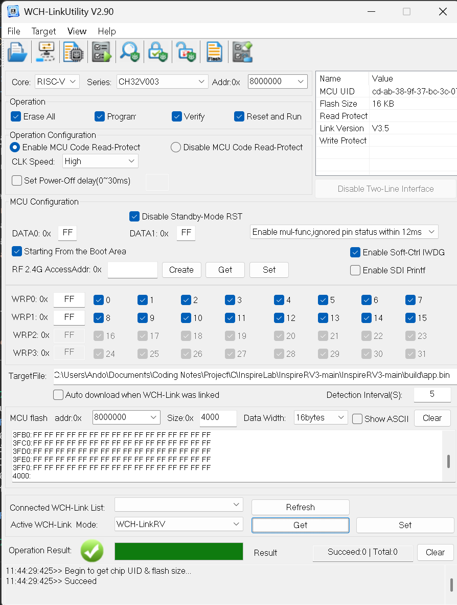

## How to compile 

Two options are available for compilation:

* `make`
  * Builds both the firmware and the emulator. After that, it also runs clean, so temporary build files are removed.

* `make firmware`
  * Builds only the firmware for the real RISC-V hardware in real_hardware/. Use this when you want the output files for flashing the physical board.

* `make emu`
  * Builds only the emulator in new_emulator_system/. Use this when you want to test the program on your computer instead of real hardware.

* `make run_emu`
  * Builds the emulator first as prequisite (check if *make emu* has been run or not). Then, it runs `./new_emulator_system/switch_page.c`.

* `make flash`
  * Builds the firmware first. Then, flash the firmware in `app.bin` to InspireRV.

* `make clean`
  * Removes all compiled files & directory from both the emulator folder and the hardware folder. Use this to clear old build results before compiling again.

* `make auto`
  * Automatically decide which one will be compiled and executed. The first priority is to check if `wlink` exist or not, so it can compile firmware and flash to `InspireRV`. The 2nd priority is to compile program and run the emulator in WindowOS.

Ensure that the **environment** used in terminal is `MSYS2 MinGW64`, otherwise this error below may occur:
* > [auto] Unknown environment: MSYS_NT-10.0-26200

## How to Flash Firmware to InspireRV

* ### Method 1: By VS Code
  * Step 1:
    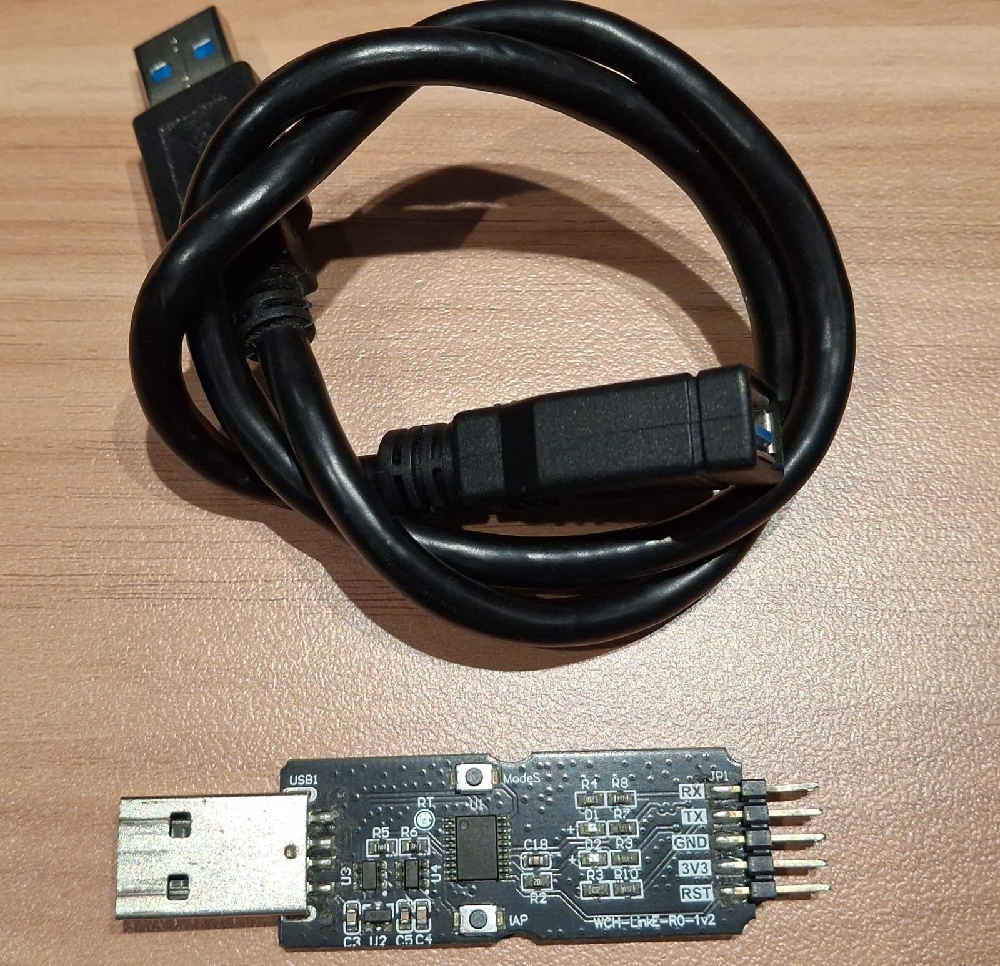
    * Prepare WCH-LinkE and USB cable extension.
    
  * Step 2:

    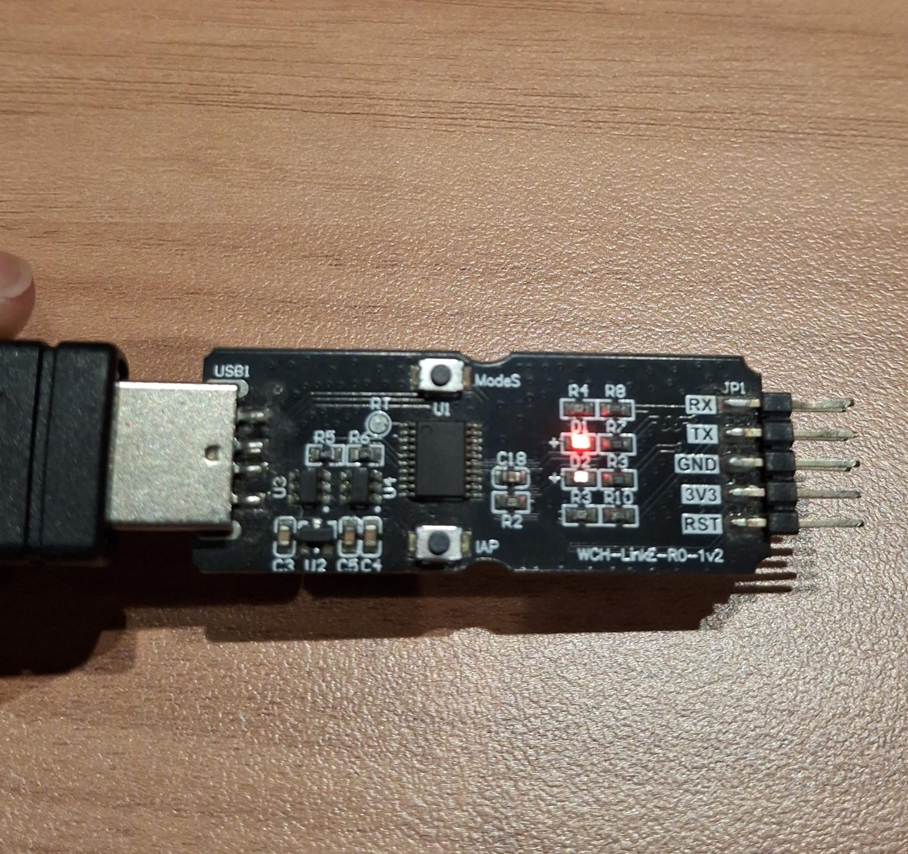
    * Ensure the working LED mode is Red which means RISCV mode.

  * Step 3:

    Side Left View|Side Right View
    :--------:|--------:
    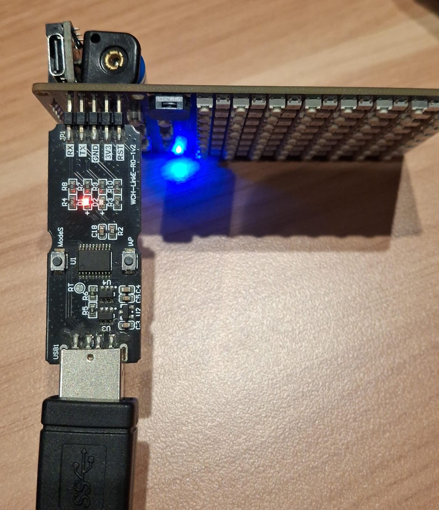|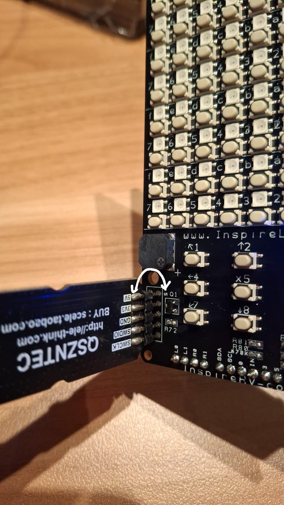
    * Connect this way.

  * Step 4:   
    * Go back to VS code, and make sure you are in project root path.
    * Setup `Zadig` everytime you want to flash via VS Code. Another way to flash is actually to do it manually via WCHLinkE software.
      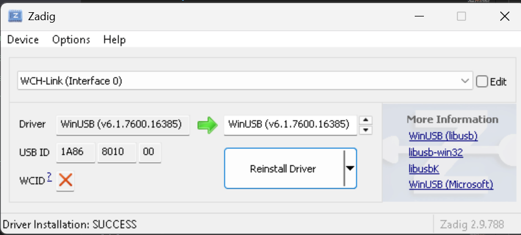
    * Type `make flash` or `make auto` using the **MSYS2 MinGW64** compiler (currently used compiler in this project).
  
  * ### Method 2: By WCH-LinkUtilityE
  * Step 1:

## Typical Error
  * **Undetected USB Device**
    * Solution: ensure that the WCH-LinkRV has been updated in `Windows Search>Device Manager Manager>USB devices/USB controller managers`. If it has been updated, the **interface** dropdown list should now include `WCH-LinkRV`
        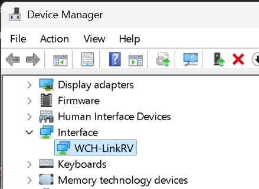

  * **USB error: incompatible driver is installed for this interface**
    * Solution: reinstall driver with `WCH-LinkRV (Interface 0) --> WinUSB` in the Zadig software.
  
  * **Error: invalid path 'nul' \n error: unable to add 'nul' to index**
    * This error occurs when you want to do `git add`.
    * Solution: manually delete the `nul` file or type this "rm nul" in the MSYS2 Mingw64 terminal.
  
  * **/bin/sh: line 1: riscv-none-elf-gcc: command not found**
    * This error occurs because you didn't download the global version of the [riscv-none-elf-gcc](https://xpack-dev-tools.github.io/riscv-none-elf-gcc-xpack/docs/install/). You should choose the one here below, and download it in the global/window CMD, not in VS Code project's terminal.
    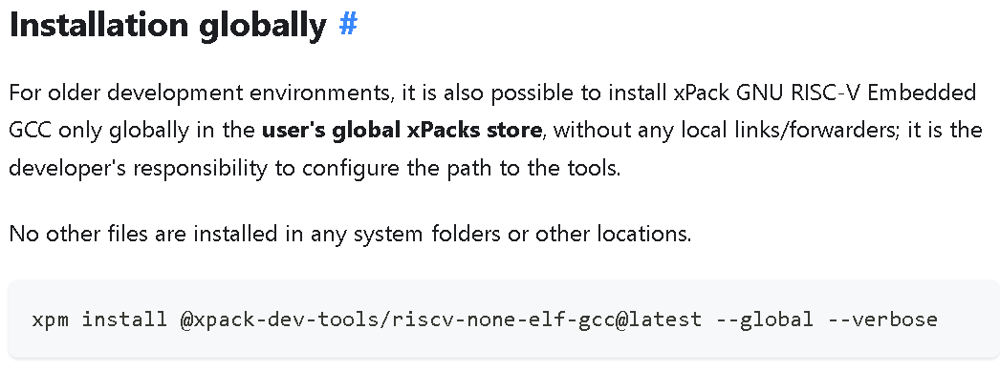


## Credits

Great thanks to these projects/sources (LICENSE included):

* <https://github.com/cnlohr/ch32v003fun>
* <https://github.com/brian-smith-github/ch32v003_stt>
* <https://github.com/mnurzia/rv>
* <https://github.com/michaeljclark/riscv-disassembler>
* <https://github.com/hexeguitar/ch32v003fun_libs>
* <https://github.com/eric15342335/inspirematrix-buttons/tree/main>
* <https://xpack-dev-tools.github.io/riscv-none-elf-gcc-xpack/docs/install/>
* <https://github.com/ch32-rs/wlink>
* <https://zadig.akeo.ie/#>

## Check out our other projects as well

* <https://github.com/eric15342335/inspirelab-game>
  * A game console based on the `CH32V003J4M6` MCU.
  * Originally from <https://github.com/wagiminator/CH32V003-GameConsole>

* <https://github.com/eric15342335/BitNetMCU>
  * Receives image data via UART and predict the digit using an ML model.
  * Originally from <https://github.com/cpldcpu/BitNetMCU>
